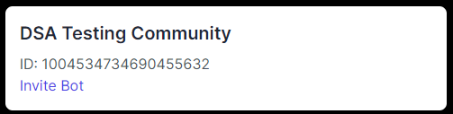
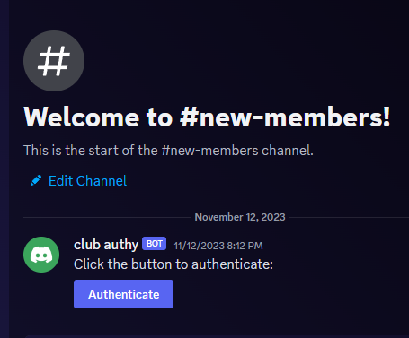
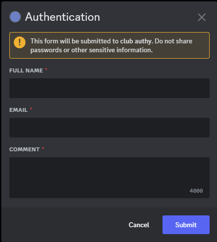

This project is to allow for university clubs to easily add student authentication to their discord servers.

Currently in development.

How to use:
When this product is live you will be able to log into the website using discord oauth2 and be able to add our bot to any server you own.

When the bot has been added it will allow users to authenticate themselves via discord in a new-members text channel.

When a user has submitted their information they will be prompted to verify their email by clicking the link in an email sent to them by our application.

Once that is complete you will see the users show up as a unapproved user in your server page on the website.

You have the ability to approve or deny users which will grant them a role to interact with your discord server or not. 

You also have the ability to see all approved members in your server so that in the case of a student policy violation you are able to determine the student's name and ID for reporting to faculty.

Documentation:
This is a Next JS 13 application using NextAuth, Tailwind, MongoDB, NodeMailer, React

System Design (in progress)
